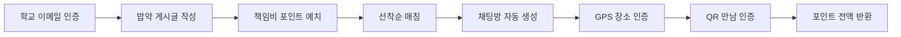
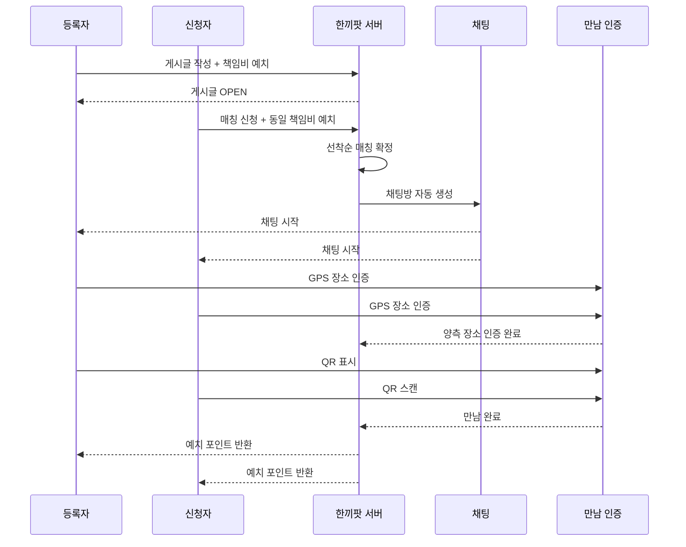
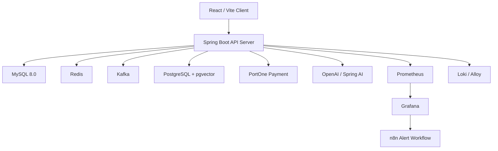
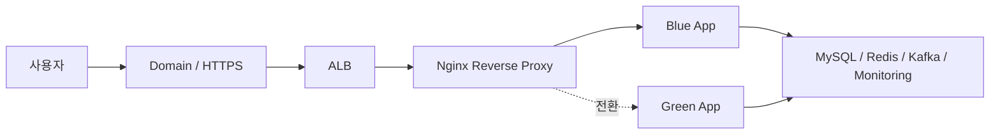

# 🍱 한끼팟

> **혼밥은 줄이고, 연결은 늘리다**  
> 같은 학교 학생끼리 밥약을 만들고, 채팅으로 약속을 잡고, 실제 만남까지 안전하게 인증하는  
> **대학생 식사 매칭 플랫폼**

<br />

## 📚 목차

- [Demo](#-demo)
- [한끼팟이 해결하는 문제](#-한끼팟이-해결하는-문제)
- [3초 만에 이해하는 한끼팟](#-3초-만에-이해하는-한끼팟)
- [핵심 기능](#-핵심-기능)
- [화면 구성](#-화면-구성)
- [서비스 플로우](#-서비스-플로우)
- [우리가 집중한 설계 포인트](#-우리가-집중한-설계-포인트)
- [ERD](#-erd)
- [시스템 아키텍처](#️-시스템-아키텍처)
- [기술 스택](#️-기술-스택)
- [프로젝트 구조](#-프로젝트-구조)
- [로컬 실행 방법](#️-로컬-실행-방법)
- [테스트 및 검증](#-테스트-및-검증)
- [보안](#-보안)
- [주요 API 엔드포인트](#-주요-api-엔드포인트)
- [Team](#-team)
- [Documents](#-documents)

<br />

<p align="center">
  
  <br />
  <b>한끼팟 로고</b>
</p>

<table align="center">
  <tr>
    <td align="center"></td>
    <td align="center"></td>
    <td align="center"></td>
    <td align="center"></td>
  </tr>
  <tr>
    <td align="center"></td>
    <td align="center"></td>
    <td align="center"></td>
    <td align="center"></td>
  </tr>
  <tr>
    <td align="center"></td>
    <td align="center"></td>
    <td align="center"></td>
    <td align="center"></td>
  </tr>
  <tr>
    <td align="center"></td>
    <td align="center"></td>
    <td align="center"></td>
    <td align="center"></td>
  </tr>
  <tr>
    <td align="center"></td>
    <td></td>
    <td></td>
    <td></td>
  </tr>
</table>

<br />

## 🎬 Demo

> 배포 링크와 시연 영상입니다.

- 서비스 URL: [https://hankkipot.cloud/](https://hankkipot.cloud/)
- 시연 영상: [한끼팟 시연 영상](https://www.notion.so/teamsparta/3872dc3ef514806c91ade2da300fec48)

<br />

## ✨ 한끼팟이 해결하는 문제

“오늘 점심 누구랑 먹지?”  
에브리타임에 글을 올리고, 댓글을 기다리고, 카톡방을 새로 파고, 결국 약속이 흐지부지되는 경험.

한끼팟은 이 과정을 하나의 흐름으로 묶었습니다.

- **학교 이메일 인증**으로 같은 학교 학생끼리만 만나요.
- **책임비 포인트 예치**로 노쇼를 줄여요.
- **실시간 채팅**으로 메뉴와 장소를 빠르게 정해요.
- **GPS + QR 인증**으로 실제 만남을 확인해요.
- **AI 추천/고객센터/운영 보조**로 더 똑똑하게 운영해요.

<br />

## 🍚 3초 만에 이해하는 한끼팟



### 1. “밥 먹을 사람?”

24학번 신입생이 “1시 반에 수업 끝나는데 정문 앞 보쌈집 가실 분?”이라는 글을 올립니다.  
노쇼 방지를 위해 책임비 `500P`를 예치합니다.

### 2. “저요!”

같은 학교 학생이 신청하면 동일한 책임비를 예치하고, 선착순으로 매칭됩니다.  
매칭이 확정되는 순간 채팅방이 자동으로 열립니다.

### 3. “진짜 만났네?”

약속 장소 반경 50m 안에서 GPS 장소 인증을 하고, 만나서 QR을 스캔하면 만남이 완료됩니다.  
정상 완료 시 양쪽의 예치 포인트는 전액 반환됩니다.

<br />

## ⭐ 핵심 기능

| 기능 | 설명 |
| --- | --- |
| 🏫 학교 이메일 인증 | `.ac.kr` 기반 OTP 인증으로 같은 학교 커뮤니티 형성 |
| 📝 밥약 게시글 | 시간, 장소, 모집 인원, 책임비를 설정해 식사팟 생성 |
| ⚡ 선착순 매칭 | 1:1 또는 그룹 매칭을 정원에 맞춰 자동 확정 |
| 💬 실시간 채팅 | WebSocket/STOMP 기반 채팅방 자동 생성 |
| 📍 GPS 장소 인증 | 약속 장소 반경 50m 안에 도착했는지 확인 |
| 🔳 QR 만남 인증 | 실제 대면 후 QR 스캔으로 만남 완료 처리 |
| 💰 포인트 예치 | 노쇼 방지를 위한 책임비 예치/반환/차감 |
| 🔔 실시간 알림 | 매칭, 채팅, 인증, 노쇼, 문의 이벤트 알림 |
| 🤖 AI 기능 | 식사팟 추천, 고객센터 상담, 관리자 운영 보조 |
| 🛡️ 관리자 콘솔 | 신고, 이의제기, 문의, 회원, 게시글 관리 |

<br />

## 🎨 화면 구성

| 화면 | 설명 |
| --- | --- |
| 로그인 / 회원가입 | 학교 이메일 OTP 인증과 약관 동의를 통한 가입 |
| 밥약 게시글 목록 / 작성 | 식사 시간, 장소, 모집 인원, 책임비를 설정해 게시글 생성 |
| 매칭 상세 | 매칭 상태, 참여자, 약속 정보, 인증 진행 상태 확인 |
| 실시간 채팅 | 매칭 확정 후 자동 생성되는 채팅방에서 약속 조율 |
| 장소 인증 / QR 인증 | GPS 기반 장소 인증과 QR 스캔으로 실제 만남 완료 처리 |
| 포인트 충전 / 결제 | PortOne 기반 포인트 충전과 결제 검증 처리 |
| 마이페이지 | 내 정보, 포인트 거래 내역, 리뷰, 매칭 이력 관리 |
| 고객센터 / 신고 / 이의제기 | 문의 접수, 신고, 노쇼 이의제기 흐름 제공 |
| 관리자 콘솔 | 회원, 게시글, 신고, 결제, 문의, 이의제기 관리 |

<br />

## 🧭 서비스 플로우



<br />

## 🔥 우리가 집중한 설계 포인트

### 1. 노쇼를 “기분”이 아니라 “시스템”으로 줄이기

한끼팟은 단순히 사람을 이어주는 서비스가 아니라, 실제 오프라인 만남까지 이어지도록 설계했습니다.

- 게시글 작성자와 신청자 모두 책임비 포인트 예치
- GPS 반경 50m 기반 장소 인증
- QR 스캔 기반 최종 만남 인증
- 미인증 시 노쇼 예정 상태 전환
- 억울한 노쇼를 막기 위한 이의제기 플로우 제공

### 2. 인기 밥약에 동시에 몰려도 정확하게 매칭하기

점심시간 직전 인기 게시글에는 여러 사용자가 동시에 신청할 수 있습니다.  
한끼팟은 중복 매칭과 포인트 중복 차감을 막기 위해 매칭 흐름을 원자적으로 처리합니다.

- Redisson 분산락 기반 선착순 신청 제어
- DB 제약 조건으로 2차 방어
- 포인트 차감, 매칭 생성, 게시글 상태 변경, 채팅방 생성의 트랜잭션 처리

### 3. AI를 서비스 안쪽에 자연스럽게 녹이기

AI는 보여주기용 기능이 아니라, 사용자가 실제로 더 쉽게 이용하고 운영자가 더 빠르게 판단하도록 돕는 도구로 사용했습니다.

- 자연어 조건 기반 식사팟 추천
- 고객센터 문의 자동 응답 보조
- 관리자 신고/운영 판단 보조
- RAG 기반 정책 문서 검색
- 토큰 사용량과 지연 시간 로깅

<br />

## 🧩 ERD

> 상세 ERD는 아래 이미지와 문서에서 확인할 수 있습니다.

<p align="center">
  
</p>

<p align="center">
  
</p>

<br />

## 🏗️ 시스템 아키텍처



### 배포 구조



- 단일 EC2 + Docker Compose 기반 운영 환경에서 시작
- HTTPS 도입으로 GPS, WebSocket 보안 연결, 브라우저 보안 API 사용 가능
- Blue-Green 배포로 배포 중 다운타임 최소화
- Prometheus, Grafana, Loki, n8n으로 로그/메트릭/알림 관측

<br />

## 🛠️ 기술 스택

| 영역 | 기술 |
| --- | --- |
| Frontend | React, TypeScript, Vite, Tailwind CSS, MUI, Radix UI, Lucide React |
| Backend | Java 17, Spring Boot 3.5.14, Spring Security, Spring Data JPA, QueryDSL |
| Realtime | WebSocket, STOMP, SSE, Kafka |
| Database | MySQL 8.0, PostgreSQL, pgvector, H2 |
| Cache / Lock | Redis, Redisson Distributed Lock |
| AI | Spring AI, OpenAI API, RAG, Tool Calling, pgvector |
| Payment | PortOne Browser SDK, PortOne Server SDK |
| Infra | Docker, Docker Compose, AWS EC2, AWS RDS, ALB, GitHub Actions |
| Monitoring | Prometheus, Grafana, Loki, Alloy, n8n, Actuator, Micrometer |
| Test / Docs | JUnit5, Mockito, Spring Security Test, Swagger, Postman, k6 |

<br />

## 📁 프로젝트 구조

```text
Final-project
├── src
│   ├── main
│   │   ├── java/com/example/team3final
│   │   │   ├── common          # 공통 설정, 보안, 예외, 응답, 인프라 설정
│   │   │   └── domain          # 도메인별 Controller, Service, Repository, DTO, Entity
│   │   │       ├── admin       # 관리자 인증, 회원, 게시글, 신고, 문의, 결제, 이의제기 관리
│   │   │       ├── ai          # AI 매칭, 고객센터, 관리자 운영 보조
│   │   │       ├── auth        # 이메일 OTP, 회원가입, 로그인, 토큰 재발급
│   │   │       ├── chat        # WebSocket/STOMP 채팅
│   │   │       ├── dispute     # 노쇼 이의제기
│   │   │       ├── inquiry     # 고객 문의
│   │   │       ├── location    # 실시간 위치 공유
│   │   │       ├── match       # 선착순 매칭
│   │   │       ├── meet        # GPS/QR 만남 인증
│   │   │       ├── notification # SSE 알림
│   │   │       ├── payment     # PortOne 결제
│   │   │       ├── pointTransaction # 포인트 거래 내역
│   │   │       ├── post        # 밥약 게시글
│   │   │       ├── report      # 신고
│   │   │       ├── review      # 후기와 매너온도
│   │   │       ├── university  # 대학 정보
│   │   │       └── user        # 사용자 프로필과 상태
│   │   └── resources
│   │       ├── prompts         # AI 프롬프트 템플릿
│   │       ├── rag-docs        # RAG 정책 문서
│   │       └── yok             # 욕설 필터링 단어 사전
│   └── test                    # 도메인별 단위/통합 테스트
├── frontend                    # React, TypeScript, Vite 클라이언트
├── docs                        # README 이미지와 문서, API 명세서
├── monitoring                  # Prometheus, Grafana, Loki 등 관측 설정
├── performance                 # 성능/부하 테스트 자료
├── docker-compose.yml
├── docker-compose.prod.yml
└── build.gradle
```

<br />

## ⚙️ 로컬 실행 방법

한끼팟은 MySQL, Redis, Kafka, PostgreSQL/pgvector, 모니터링 도구를 함께 사용하므로 전체 실행은 Docker Compose 기준을 권장합니다.

### 1. 환경 변수 준비

루트의 `.env`와 `frontend/.env.local` 파일이 필요합니다.  
실제 키와 비밀번호는 Git에 올리지 않고 로컬 또는 배포 환경에서 별도로 관리합니다.

### 2. 전체 서비스 실행

```bash
docker compose up --build -d
```

- Frontend: `http://localhost:5173`
- Backend API: `http://localhost:8080`
- Swagger UI: `http://localhost:8080/swagger-ui.html`
- Grafana: `http://localhost:3000`
- Prometheus: `http://localhost:9090`

### 3. 프론트엔드 단독 개발 실행

백엔드가 이미 실행 중인 상태에서 프론트엔드만 빠르게 개발할 때 사용합니다.

```bash
cd frontend
pnpm install
pnpm dev
```

### 4. 백엔드 로컬 JVM 실행

Redis와 Kafka 등 필요한 인프라가 준비되어 있고 `.env` 값이 설정되어 있다면 로컬 프로필로 백엔드를 실행할 수 있습니다.

```bash
./gradlew bootRun --args='--spring.profiles.active=local'
```

<br />

## ✅ 테스트 및 검증

- JUnit5 기반 도메인별 단위/통합 테스트
- Spring Security Test 기반 인증/인가 테스트
- 포인트, 결제, 채팅방, 리뷰 등 중복 요청 방어 테스트
- Redisson 분산락 기반 선착순 매칭 동시성 제어
- k6 기반 게시글 목록 및 알림 부하 테스트
- Swagger/OpenAPI 문서를 통한 API 계약 확인
- 주요 테스트 케이스를 5회 반복 실행하며 기능 정상 동작 확인

```bash
./gradlew test
```

<br />

## 🔒 보안

- 학교 이메일 OTP 인증으로 같은 학교 사용자 검증
- JWT 기반 사용자/관리자 인증과 권한 분리
- Spring Security 기반 보호 API 접근 제어
- HTTPS 배포로 GPS, QR, WebSocket 등 브라우저 보안 API 지원
- 책임비 포인트 예치와 노쇼 이의제기로 오프라인 만남 신뢰성 보완
- 신고, 문의, 관리자 제재 기능으로 운영 리스크 대응
- `.env` 기반 민감 정보 외부화

<br />

## 📌 주요 API 엔드포인트

> 상세 API 명세는 [`docs/api-spec.md`](./docs/api-spec.md)에서 관리합니다.  
> README에는 전체 흐름을 파악할 수 있도록 엔드포인트만 정리합니다.

<details>
<summary><b>인증 / 유저 / 대학</b></summary>

| Method | Endpoint | Description |
| --- | --- | --- |
| POST | `/api/v1/auth/email/otp` | 이메일 OTP 발송 |
| POST | `/api/v1/auth/email/otp/verify` | 이메일 OTP 검증 |
| POST | `/api/v1/auth/signup` | 회원가입 |
| POST | `/api/v1/auth/login` | 로그인 |
| POST | `/api/v1/auth/logout` | 로그아웃 |
| POST | `/api/v1/auth/refresh` | 토큰 재발급 |
| GET | `/api/v1/users/me` | 내 정보 조회 |
| PATCH | `/api/v1/users/me` | 내 정보 수정 |
| DELETE | `/api/v1/users/me` | 회원 탈퇴 |
| GET | `/api/v1/universities` | 대학 목록 조회 |

</details>

<details>
<summary><b>게시글 / 매칭</b></summary>

| Method | Endpoint | Description |
| --- | --- | --- |
| POST | `/api/v1/posts` | 게시글 작성 |
| GET | `/api/v1/posts` | 게시글 목록 조회 |
| GET | `/api/v1/posts/{postId}` | 게시글 상세 조회 |
| PATCH | `/api/v1/posts/{postId}` | 게시글 수정 |
| DELETE | `/api/v1/posts/{postId}` | 게시글 삭제 |
| GET | `/api/v1/posts/{postId}/delete-reason` | 삭제된 게시글 사유 조회 |
| POST | `/api/v1/posts/{postId}/matches` | 매칭 신청 |
| GET | `/api/v1/matches/{matchId}` | 매칭 상세 조회 |
| GET | `/api/v1/matches/me` | 내 매칭 목록 조회 |
| PATCH | `/api/v1/matches/{matchId}/cancel` | 매칭 취소 |

</details>

<details>
<summary><b>위치 / 만남 인증 / 시간 연장</b></summary>

| Method | Endpoint | Description |
| --- | --- | --- |
| PUT | `/api/v1/matches/{matchId}/location` | 내 위치 업데이트 |
| GET | `/api/v1/matches/{matchId}/location` | 양측 위치 조회 |
| POST | `/api/v1/matches/{matchId}/place-verification` | GPS 장소 인증 |
| GET | `/api/v1/posts/{postId}/qr` | 등록자 QR 토큰 조회 |
| POST | `/api/v1/matches/{matchId}/qr/scan` | 신청자 QR 스캔 |
| GET | `/api/v1/matches/{matchId}/verification` | 만남 인증 상태 조회 |
| POST | `/api/v1/matches/{matchId}/extension/request` | 만남 시간 연장 요청 |
| PATCH | `/api/v1/matches/{matchId}/extension/accept` | 만남 시간 연장 수락 |
| PATCH | `/api/v1/matches/{matchId}/extension/reject` | 만남 시간 연장 거절 |
| GET | `/api/v1/matches/{matchId}/extension` | 만남 시간 연장 상태 조회 |

</details>

<details>
<summary><b>채팅 / 알림</b></summary>

| Method | Endpoint | Description |
| --- | --- | --- |
| GET | `/api/v1/chat-rooms/{chatRoomId}/messages` | 채팅 메시지 목록 조회 |
| GET | `/api/v1/chat-rooms/{chatRoomId}/members` | 채팅방 참여자 목록 조회 |
| SockJS | `/ws/chat?token={accessToken}` | WebSocket 연결 |
| STOMP SEND | `/pub/chat/rooms/{chatRoomId}` | 채팅 메시지 전송 |
| STOMP SUBSCRIBE | `/sub/chat/rooms/{chatRoomId}` | 채팅방 구독 |
| GET | `/api/v1/notifications` | 알림 목록 조회 |
| PATCH | `/api/v1/notifications/read-all` | 알림 전체 읽음 처리 |
| PATCH | `/api/v1/notifications/{notificationId}/read` | 알림 단건 읽음 처리 |
| GET | `/api/v1/notifications/unread-count` | 미확인 알림 개수 조회 |
| GET | `/api/v1/notifications/subscribe` | 실시간 알림 SSE 구독 |

</details>

<details>
<summary><b>포인트 / 결제 / 리뷰</b></summary>

| Method | Endpoint | Description |
| --- | --- | --- |
| GET | `/api/v1/me/points/transactions` | 내 포인트 거래 내역 조회 |
| POST | `/api/v1/payments` | 결제 준비 |
| POST | `/api/v1/payments/{paymentId}/verify` | 결제 완료 검증 |
| GET | `/api/v1/payments/me` | 내 결제 내역 조회 |
| PATCH | `/api/v1/payments/{paymentId}/cancel` | 결제 취소 및 환불 |
| PATCH | `/api/v1/payments/{paymentId}/fail` | 결제 실패 처리 |
| POST | `/api/v1/matches/{matchId}/reviews` | 후기 작성 |
| GET | `/api/v1/me/reviews` | 내가 작성한 후기 목록 조회 |

</details>

<details>
<summary><b>신고 / 이의제기 / 고객문의</b></summary>

| Method | Endpoint | Description |
| --- | --- | --- |
| POST | `/api/v1/reports` | 게시글 신고 접수 |
| POST | `/api/v1/matches/{matchId}/disputes` | 이의제기 제출 |
| GET | `/api/v1/matches/{matchId}/disputes/me` | 내 이의제기 상세 조회 |
| GET | `/api/v1/disputes/me` | 내 이의제기 전체 목록 조회 |
| POST | `/api/v1/matches/{matchId}/disputes/resubmit` | 보류 이의제기 재신청 |
| POST | `/api/v1/inquiries` | 고객문의 접수 |
| GET | `/api/v1/inquiries/{inquiryId}` | 내 문의 상세 조회 |
| GET | `/api/v1/inquiries/me` | 내 문의 목록 조회 |
| PATCH | `/api/v1/inquiries/{inquiryId}/cancel` | 고객 문의 취소 |

</details>

<details>
<summary><b>AI</b></summary>

| Method | Endpoint | Description |
| --- | --- | --- |
| POST | `/api/v1/ai/matching/chat/stream` | AI 식사팟 매칭 추천 |
| DELETE | `/api/v1/ai/matching/chat/{conversationId}` | AI 식사팟 매칭 대화 세션 삭제 |
| POST | `/api/v1/ai/support/chat/stream` | AI 고객센터 상담 |
| POST | `/api/v1/admin/ai/reports/chat/stream` | 관리자 신고·이의제기 검토 AI 상담 |
| POST | `/api/v1/admin/ai/console/chat/stream` | 관리자 운영 현황·정책 안내 AI 상담 |

</details>

<details>
<summary><b>관리자</b></summary>

| Method | Endpoint | Description |
| --- | --- | --- |
| POST | `/api/v1/admin/auth/login` | 관리자 로그인 |
| GET | `/api/v1/admin/users` | 회원 목록 조회 |
| PATCH | `/api/v1/admin/users/{userId}/suspend` | 회원 계정 정지 |
| PATCH | `/api/v1/admin/users/{userId}/reinstate` | 회원 정지 해제 |
| GET | `/api/v1/admin/posts` | 관리자 게시글 목록 조회 |
| GET | `/api/v1/admin/posts/{postId}` | 관리자 게시글 상세 조회 |
| DELETE | `/api/v1/admin/posts/{postId}` | 게시글 강제 삭제 |
| POST | `/api/v1/admin/posts/{postId}/restore` | 강제 삭제 게시글 복구 |
| GET | `/api/v1/admin/reports` | 관리자 신고 목록 조회 |
| GET | `/api/v1/admin/reports/{reportId}` | 관리자 신고 상세 조회 |
| PATCH | `/api/v1/admin/reports/{reportId}/process` | 관리자 신고 처리 |
| GET | `/api/v1/admin/payments` | 관리자 결제 내역 조회 |
| GET | `/api/v1/admin/no-show-candidates` | 노쇼 후보군 조회 |
| GET | `/api/v1/admin/disputes` | 관리자 이의제기 목록 조회 |
| GET | `/api/v1/admin/disputes/{disputeId}` | 관리자 이의제기 상세 조회 |
| PATCH | `/api/v1/admin/disputes/{disputeId}/judge` | 관리자 이의제기 판정 |
| PATCH | `/api/v1/admin/disputes/{disputeId}/override` | 이의제기 상태 강제 변경 |
| GET | `/api/v1/admin/inquiries` | 관리자 문의 목록 조회 |
| GET | `/api/v1/admin/inquiries/{inquiryId}` | 관리자 문의 상세 조회 |
| POST | `/api/v1/admin/inquiries/{inquiryId}/answers` | 관리자 문의 답변 등록 |
| GET | `/api/v1/admin/notifications` | 관리자 알림 목록 조회 |
| PATCH | `/api/v1/admin/notifications/read-all` | 관리자 알림 전체 읽음 처리 |
| PATCH | `/api/v1/admin/notifications/{notificationId}/read` | 관리자 알림 개별 읽음 처리 |
| GET | `/api/v1/admin/notifications/unread-count` | 관리자 미확인 알림 개수 조회 |
| GET | `/api/v1/admin/notifications/subscribe` | 관리자 실시간 알림 구독 |

</details>

<br />

## 👥 Team

| 이름 | GitHub | 담당 도메인 |
| --- | --- | --- |
| 정호진 | [Ho-jin98](https://github.com/Ho-jin98/k-server-project.git) | 만남 인증, 위치, 관리자, 부하 테스트, 캐싱 |
| 박수지 | [e0321e-sudo](https://github.com/e0321e-sudo/plan.git) | 채팅, 알림, 신고, WebSocket, Kafka, SSE |
| 문혜린 | [munhyerin22](https://github.com/munhyerin22) | 인증/인가, 유저, 고객문의, 약관, CI/CD, 배포 |
| 최형민 | [godchm](https://github.com/godchm/) | 대학, 포인트, AI, 리뷰, 모니터링 |
| 류호정 | [ghwjd6767-gif](https://github.com/ghwjd6767-gif) | 게시글, 매칭, 결제, 동시성 제어, QueryDSL |

<br />

## 📚 Documents

| 문서 | 링크 |
| --- | --- |
| API 명세서 | [`docs/api-spec.md`](./docs/api-spec.md) |
| ERD | [`docs/erd.md`](./docs/erd.md) |
| 배포 고도화 | [`docs/deployment.md`](./docs/deployment.md) |
| 트러블슈팅 | [`docs/troubleshooting/README.md`](./docs/troubleshooting/README.md) |

<br />

<p align="center">
  <b>한 끼가 어색한 시작을 자연스러운 연결로 바꾸는 순간</b><br />
  🍱 한끼팟
</p>
