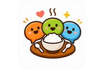
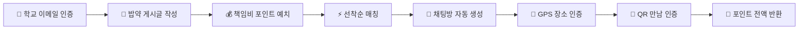
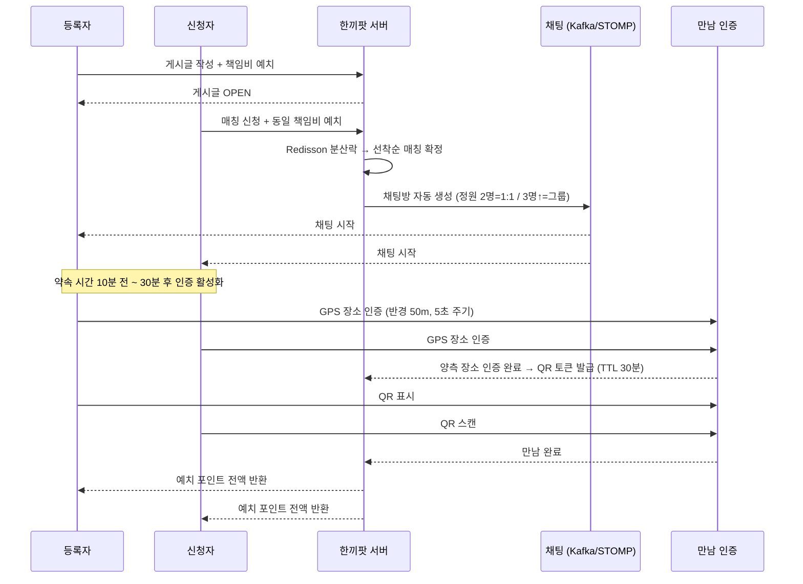
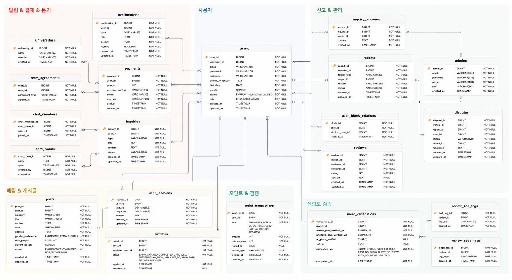
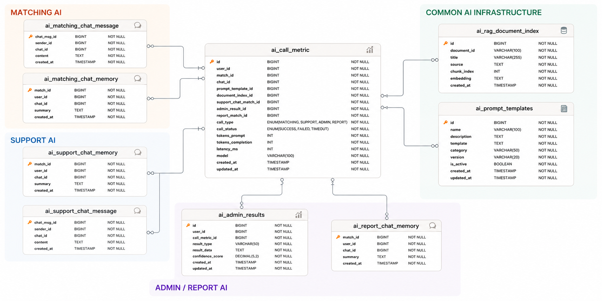
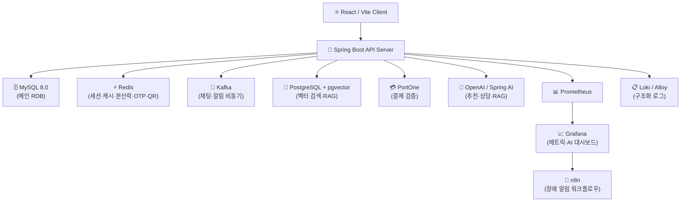
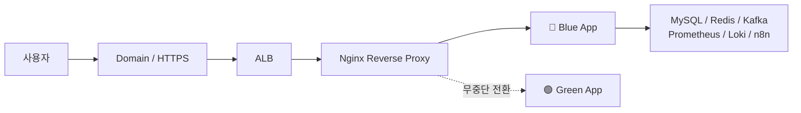

# 🍱 한끼팟

> **혼밥은 줄이고, 연결은 늘리다**
> 같은 학교 학생끼리 밥약을 만들고, 채팅으로 약속을 잡고, 실제 만남까지 안전하게 인증하는
> **대학생 식사 매칭 플랫폼**

## 📚 목차

- [Demo](#-demo)
- [한끼팟이 해결하는 문제](#-한끼팟이-해결하는-문제)
- [3초 만에 이해하는 한끼팟](#-3초-만에-이해하는-한끼팟)
- [핵심 기능](#-핵심-기능)
- [화면 구성](#-화면-구성)
- [서비스 플로우](#-서비스-플로우)
- [우리가 집중한 설계 포인트](#-우리가-집중한-설계-포인트)
- [기술 선택 근거](#-기술-선택-근거)
- [ERD](#-erd)
- [시스템 아키텍처](#️-시스템-아키텍처)
- [기술 스택](#️-기술-스택)
- [프로젝트 구조](#-프로젝트-구조)
- [로컬 실행 방법](#️-로컬-실행-방법)
- [테스트 및 검증](#-테스트-및-검증)
- [보안](#-보안)
- [주요 API 엔드포인트](#-주요-api-엔드포인트)
- [트러블슈팅](#-트러블슈팅)
- [Team](#-team)
- [Documents](#-documents)

<br />

<p align="center">
  
  <br />
  <b>한끼팟 로고</b>
</p>

<table align="center">
  <tr>
    <td align="center"></td>
    <td align="center"></td>
    <td align="center"></td>
    <td align="center"></td>
  </tr>
  <tr>
    <td align="center"></td>
    <td align="center"></td>
    <td align="center"></td>
    <td align="center"></td>
  </tr>
  <tr>
    <td align="center"></td>
    <td align="center"></td>
    <td align="center"></td>
    <td align="center"></td>
  </tr>
  <tr>
    <td align="center"></td>
    <td align="center"></td>
    <td align="center"></td>
    <td align="center"></td>
  </tr>
  <tr>
    <td align="center"></td>
    <td align="center"></td>
    <td align="center"></td>
    <td align="center"></td>
  </tr>
</table>

<br />

## 🎬 Demo

> 배포 링크와 시연 영상입니다.

- 서비스 URL: [https://hankkipot.cloud/](https://hankkipot.cloud/)
- 시연 영상: [한끼팟 시연 영상](https://www.notion.so/teamsparta/3872dc3ef514806c91ade2da300fec48)

<br />

## ✨ 한끼팟이 해결하는 문제

"오늘 점심 누구랑 먹지?"
글을 올리고, 댓글을 기다리고, 카톡방을 새로 파고, 결국 약속이 흐지부지되는 경험.

한끼팟은 이 과정을 하나의 흐름으로 묶었습니다.

- **학교 이메일 인증**으로 같은 학교 학생끼리만 만나요.
- **책임비 포인트 예치**로 노쇼를 구조적으로 줄여요.
- **실시간 채팅**으로 메뉴와 장소를 빠르게 정해요.
- **GPS + QR 인증**으로 실제 만남을 객관적으로 확인해요.
- **AI 추천 / 고객센터 / 운영 보조**로 더 스마트하게 운영해요.

<br />

## 🍚 3초 만에 이해하는 한끼팟



### 1. "밥 먹을 사람?"

24학번 신입생이 "1시 반에 수업 끝나는데 정문 앞 보쌈집 가실 분?"이라는 글을 올립니다.
노쇼 방지를 위해 책임비 `500P`를 예치합니다.

### 2. "저요!"

같은 학교 학생이 신청하면 동일한 책임비를 예치하고, 선착순으로 매칭됩니다.
매칭이 확정되는 순간 채팅방이 자동으로 열립니다.

### 3. "진짜 만났네?"

약속 장소 반경 50m 안에서 GPS 장소 인증을 하고, 만나서 QR을 스캔하면 만남이 완료됩니다.
정상 완료 시 양쪽의 예치 포인트는 전액 반환됩니다.

<br />

## ⭐ 핵심 기능

| 기능 | 설명 |
| --- | --- |
| 🏫 학교 이메일 인증 | `.ac.kr` 기반 OTP 인증으로 같은 학교 폐쇄형 커뮤니티 형성 |
| 📝 밥약 게시글 | 시간, 장소, 모집 인원(최소 2명~최대 10명), 책임비를 설정해 식사팟 생성 |
| ⚡ 선착순 매칭 | 1:1 또는 그룹 매칭 — Redisson 분산락으로 동시 신청 정확 처리 |
| 💬 실시간 채팅 | WebSocket/STOMP + Kafka 기반 채팅방 자동 생성 및 그룹 채팅 지원 |
| 📍 GPS 장소 인증 | 약속 장소 반경 50m 이내 도착 여부 — 5초 주기 위치 업데이트 |
| 🔳 QR 만남 인증 | 실제 대면 후 QR 스캔으로 만남 완료 처리 (TTL 기반 단기 토큰) |
| 💰 포인트 예치 시스템 | 노쇼 방지 책임비 예치·반환·차감 / 취소 시 50% 몰수 정책 |
| 🔔 실시간 알림 (SSE) | 매칭·채팅·인증·노쇼·문의 등 34종 이벤트 알림 |
| 🤖 AI 기능 | 식사팟 추천(Tool Calling), 고객센터 자동상담, 관리자 운영 보조, RAG |
| 🛡️ 관리자 콘솔 | 신고·이의제기·문의·회원·게시글 통합 관리 |

<br />

## 🎨 화면 구성

| 화면 | 설명 |
| --- | --- |
| 로그인 / 회원가입 | 학교 이메일 OTP 인증과 약관 동의를 통한 가입 |
| 밥약 게시글 목록 / 작성 | 식사 시간, 장소, 모집 인원, 책임비 설정해 게시글 생성 |
| 매칭 상세 | 매칭 상태, 참여자, 약속 정보, 인증 진행 상태 확인 |
| 실시간 채팅 | 매칭 확정 후 자동 생성되는 채팅방에서 약속 조율 |
| 장소 인증 / QR 인증 | 파란 점(나) · 빨간 점(상대방) 지도 UI, GPS 기반 50m 반경 인증 |
| 포인트 충전 / 결제 | PortOne 기반 포인트 충전 |
| 마이페이지 | 내 정보, 포인트 거래 내역, 매칭 이력 관리 |
| 고객센터 / 신고 / 이의제기 | 문의 접수, 신고, 노쇼 이의제기 플로우 (6가지 사유) |
| 관리자 콘솔 | 회원, 게시글, 신고, 결제, 문의, 이의제기 통합 관리 |

<br />

## 🧭 서비스 플로우



<br />

## 🔥 우리가 집중한 설계 포인트

### 1. 노쇼를 "기분"이 아니라 "시스템"으로 줄이기

한끼팟은 단순히 사람을 이어주는 서비스가 아니라, 실제 오프라인 만남까지 이어지도록 설계했습니다.

- 게시글 작성자와 신청자 **모두** 책임비 포인트 예치 (최소 200P, 100P 단위)
- 약속 시간 이전 취소 시 예치 포인트 **50%만 반환** (무책임한 취소 억제)
- GPS 반경 50m 기반 **1단계 장소 인증** — 이동 속도 고려해 5초 주기 업데이트 설계
- QR 스캔 기반 **2단계 최종 만남 인증** — TTL 토큰으로 재사용/위변조 방지
- 미인증 시 **노쇼 예정 상태** 전환 → 자동 포인트 차감
- 억울한 노쇼를 막기 위한 **이의제기 플로우** (6개 사유 + 관리자 판정)

### 2. 인기 밥약에 동시에 몰려도 정확하게 매칭하기

점심시간 직전 인기 게시글에는 여러 사용자가 동시에 신청할 수 있습니다.
중복 매칭과 포인트 중복 차감을 막기 위해 매칭 흐름을 원자적으로 처리합니다.

- **1:1 매칭** (정원 2명): `tryLock()` 즉시 실패 전략 — 이미 자리가 없으면 바로 실패 응답 → 빠른 UX
- **단체 매칭** (정원 3명↑): `tryLock(500ms)` 대기 전략 — 남은 자리 수만큼 동시 신청자를 순차 처리 → 빈자리 없이 정확히 마감
- DB 유니크 제약조건으로 **2차 방어**
- 포인트 차감 → 매칭 생성 → 게시글 상태 전환 → 채팅방 생성을 **단일 트랜잭션**으로 처리

```
[설계 트레이드오프]
즉시 실패 vs 대기 전략을 매칭 유형별로 분리한 이유:
1:1은 "내가 빠르게 못 잡으면 끝"이라는 UX가 자연스럽고,
단체는 "동시에 5명이 눌러도 3자리가 모두 채워져야" 서비스 가치가 있기 때문입니다.
```

### 3. AI를 서비스 안쪽에 자연스럽게 녹이기

AI는 보여주기용 기능이 아니라, 사용자가 더 쉽게 이용하고 운영자가 더 빠르게 판단하도록 돕는 실질적인 도구로 사용했습니다.

- **Spring AI `@Tool`** 기반 자연어 조건 식사팟 추천 (게시글 검색 API 연동)
- **SSE 스트리밍** 응답으로 AI 답변이 끊기지 않고 실시간으로 렌더링
- **RAG** 기반 정책 문서 검색 (pgvector + 유사도 임계값 필터링으로 환각 방어)
- **멀티턴 대화 세션** + 최근 N턴 윈도우 관리로 비용 제어
- **토큰 사용량 · 응답 지연 · 에러율** 로깅 → Grafana 대시보드에서 추적
- Tool 호출 실패 시 **자연어 안내 fallback** → AI 장애가 핵심 서비스에 영향 없도록 격리

### 4. 위치 정보는 필요한 순간에만, 그리고 즉시 삭제

GPS 데이터는 민감한 개인정보입니다. 개인정보 최소 수집 원칙에 따라 설계했습니다.

- 위치 데이터를 `meet_verifications`와 분리된 별도 `user_location` 테이블로 관리
- 장소 인증 단계(`MATCHED` 상태)에서만 5초 주기로 수집
- 만남 완료 / 취소 / 노쇼 시 **즉시 삭제** 처리

```
[업데이트 주기 설계 근거]
- 1초: 너무 잦음 → 서버 부하, 배터리 소모
- 5초: 균형점 ✅ — 자전거(15km/h) 기준 5초에 약 20m 이동, 50m 반경 감지 가능
- 10초: 너무 느림 → 위치 부정확 (전동킥보드 기준 5초에 35m 이동)
```

<br />

## 🛠 기술 선택 근거

### 왜 Redisson 분산락인가?

매칭 신청은 "같은 자원(게시글의 남은 자리)을 동시에 여러 서버에서 수정"하는 전형적인 분산 환경 동시성 문제입니다.

| 방법 | 한계 |
| --- | --- |
| Java `synchronized` | 단일 JVM에서만 유효 — 다중 인스턴스 배포 시 무력화 |
| DB 비관락 (`SELECT FOR UPDATE`) | 락 경합 시 DB 커넥션 점유 시간 증가, 타임아웃 위험 |
| DB 낙관락 (`@Version`) | 충돌 시 재시도 로직 필요 — 고트래픽에서 재시도 폭발 위험 |
| **Redisson 분산락** | 네트워크 장애 시 TTL로 자동 해제 ✅, WatchDog으로 처리 중 만료 방지 ✅ |

1:1 매칭은 `tryLock()` 즉시 실패, 단체 매칭은 `tryLock(500ms)` 대기로 **매칭 유형별로 전략을 분리**해 UX와 정확성을 모두 잡았습니다.

---

### 왜 Kafka인가?

채팅 메시지와 알림은 "메시지를 보낸 즉시 응답"해야 하는 동기 처리와, "모든 구독자에게 안정적으로 전달"해야 하는 비동기 처리를 동시에 만족해야 합니다.

| 방법 | 한계 |
| --- | --- |
| Spring 내장 `@EventListener` | 서버 재시작 시 미처리 이벤트 유실 |
| RabbitMQ | 메시지 순서 보장이 어렵고, 고처리량에서 한계 |
| **Kafka** | 파티션 기반 순서 보장 ✅, 메시지 영구 저장 ✅, Consumer 장애 시 재처리 ✅ |

채팅 메시지는 Kafka를 통해 비동기로 DB에 영구 저장하고, 알림 이벤트는 SSE로 클라이언트에 실시간 전달합니다.

---

### 왜 QueryDSL인가?

게시글 목록 조회는 **책임비 높은 순 / 만남 시간 임박 순 / 최신 순** 정렬 조건과, 학교 필터 + 상태 필터 + 페이징이 조합됩니다.

| 방법 | 한계 |
| --- | --- |
| JPA JPQL | 동적 조건 조합 시 문자열 concat — 컴파일 시점 오류 탐지 불가 |
| `@Query` 네이티브 SQL | DB 종속, 유지보수 어려움 |
| **QueryDSL** | 타입 안전 동적 쿼리 ✅, IDE 자동완성 ✅, 컴파일 타임 검증 ✅ |

---

### 왜 Redis를 세션 저장소로 사용하는가?

JWT Refresh Token을 DB에 저장하면 토큰 검증마다 DB I/O가 발생합니다. Redis는 인메모리 저장소로 **TTL 기반 자동 만료**까지 지원해 토큰 블랙리스트 관리에 최적입니다.

- Refresh Token 저장 (TTL = 토큰 만료 시간)
- 로그아웃 시 블랙리스트 등록 → 재사용 방지
- OTP 인증번호 임시 저장 (TTL 5분)
- QR 토큰 저장 (TTL 30분)

---

### 왜 PostgreSQL + pgvector인가?

AI 식사팟 추천과 고객센터 RAG에 필요한 벡터 유사도 검색을 별도 벡터 DB(Pinecone, Weaviate 등) 없이 처리하기 위해 선택했습니다.

- 유사도 임계값 필터링으로 관련성 낮은 결과가 LLM 컨텍스트에 주입되는 것을 차단
- 기존 PostgreSQL 인프라와 통합 — 운영 복잡도 최소화
- pgvector `ivfflat` 인덱스로 근사 최근접 이웃(ANN) 검색 지원

---

### 왜 Blue/Green 무중단 배포인가?

단순 재시작 배포는 WebSocket 연결이 끊기고, 진행 중인 채팅과 위치 인증이 중단됩니다.

- Blue 환경에서 Green으로 Nginx 라우팅을 전환하는 방식으로 다운타임 0초 배포
- 배포 실패 시 Nginx 설정 변경만으로 즉시 롤백

<br />

## 🧩 ERD

> 상세 ERD는 아래 이미지와 문서에서 확인할 수 있습니다.

<p align="center">
  
</p>

<p align="center">
  
</p>

### 핵심 설계 결정

- `user.freePoint` / `user.paidPoint`는 **캐시 컬럼** — 실제 정합성은 `point_transaction` 누계로 검증
- `user_location` 테이블은 `meet_verifications`와 분리 — 장소 인증 완료 시 즉시 삭제하는 생명주기 적용
- `disputes` 이의제기 테이블은 `HOLD` 상태에서 24시간 내 재신청 가능 구조로 설계

<br />

## 🏗️ 시스템 아키텍처



### 배포 구조



<br />

## 🛠️ 기술 스택

| 분류 | 기술 | 선택 이유 |
| --- | --- | --- |
| **Backend** | Java 17, Spring Boot 3.5.14 | LTS 버전, Virtual Thread 지원 가능성 |
| **Frontend** | React 18.3.1, Vite 6.3.5 | 빠른 HMR, 최신 React 동시성 기능 |
| **Main DB** | MySQL 8.0 | 트랜잭션 안정성, 팀 친숙도 |
| **Cache / Lock** | Redis 7 + Redisson | 분산락 WatchDog 지원, TTL 기반 자동 만료 |
| **Message Queue** | Kafka | 파티션 기반 순서 보장, 메시지 영구 저장, 재처리 |
| **Vector DB** | PostgreSQL + pgvector | 기존 인프라 통합, 별도 벡터 DB 없이 RAG 구현 |
| **AI** | Spring AI 1.1.2 + OpenAI | `@Tool` 기반 Tool Calling, SSE 스트리밍 추상화 |
| **실시간 채팅** | WebSocket + STOMP + SockJS | 브라우저 호환성, Spring 공식 지원 |
| **실시간 알림** | SSE | 단방향 서버→클라이언트, WebSocket 대비 구현 단순 |
| **타입 안전 쿼리** | QueryDSL 5.1.0 | 컴파일 타임 검증, 동적 조건 조합 |
| **결제** | PortOne | 국내 PG 통합 지원, 검증 API 제공 |
| **모니터링** | Prometheus + Grafana + Loki + Alloy | 메트릭/로그 분리 수집, n8n 장애 알림 연동 |
| **자동화** | n8n | 코드 없이 Grafana 알림→슬랙 워크플로우 구성 |
| **배포** | Docker, GitHub Actions, Blue/Green | 무중단 배포, 롤백 용이성 |
| **부하 테스트** | k6 | JS 기반 시나리오 작성, P95/P99 지표 수집 |

<br />

## 📁 프로젝트 구조

```
Final-project
├── src
│   ├── main
│   │   ├── java/com/example/team3final
│   │   │   ├── common          # 공통 설정, 보안, 예외, 응답, 인프라 설정
│   │   │   └── domain          # 도메인별 Controller, Service, Repository, DTO, Entity
│   │   │       ├── admin       # 관리자 인증, 회원, 게시글, 신고, 문의, 결제, 이의제기 관리
│   │   │       ├── ai          # AI 매칭, 고객센터, 관리자 운영 보조
│   │   │       ├── auth        # 이메일 OTP, 회원가입, 로그인, 토큰 재발급
│   │   │       ├── chat        # WebSocket/STOMP 채팅
│   │   │       ├── dispute     # 노쇼 이의제기
│   │   │       ├── inquiry     # 고객 문의
│   │   │       ├── location    # 실시간 위치 공유
│   │   │       ├── match       # 선착순 매칭
│   │   │       ├── meet        # GPS/QR 만남 인증
│   │   │       ├── notification # SSE 알림
│   │   │       ├── payment     # PortOne 결제
│   │   │       ├── pointTransaction # 포인트 거래 내역
│   │   │       ├── post        # 밥약 게시글
│   │   │       ├── report      # 신고
│   │   │       ├── review      # 후기와 매너온도
│   │   │       ├── university  # 대학 정보
│   │   │       └── user        # 사용자 프로필과 상태
│   │   └── resources
│   │       ├── prompts         # AI 프롬프트 템플릿
│   │       ├── rag-docs        # RAG 정책 문서
│   │       └── yok             # 욕설 필터링 단어 사전
│   └── test                    # 도메인별 단위/통합 테스트
├── frontend                    # React, TypeScript, Vite 클라이언트
├── docs                        # README 이미지와 문서, API 명세서
├── monitoring                  # Prometheus, Grafana, Loki 등 관측 설정
├── performance                 # 성능/부하 테스트 자료
├── docker-compose.yml
├── docker-compose.prod.yml
└── build.gradle
```

<br />

## ⚙️ 로컬 실행 방법

한끼팟은 MySQL, Redis, Kafka, PostgreSQL/pgvector, 모니터링 도구를 함께 사용하므로 전체 실행은 Docker Compose 기준을 권장합니다.

### 1. 환경 변수 준비

루트의 `.env`와 `frontend/.env.local` 파일이 필요합니다.
실제 키와 비밀번호는 Git에 올리지 않고 로컬 또는 배포 환경에서 별도로 관리합니다.

```bash
# .env 예시 (실제 값은 팀 내부 공유)
MYSQL_PASSWORD=...
REDIS_PASSWORD=...
OPENAI_API_KEY=...
PORTONE_SECRET=...
JWT_SECRET=...
```

### 2. 전체 서비스 실행 (권장)

```bash
docker compose up --build -d
```

| 서비스 | 주소 |
| --- | --- |
| Frontend | http://localhost:5173 |
| Backend API | http://localhost:8080 |
| Swagger UI | http://localhost:8080/swagger-ui.html |
| Grafana | http://localhost:3000 |
| Prometheus | http://localhost:9090 |
| n8n | http://localhost:5678 |

### 3. 프론트엔드 단독 개발 실행

백엔드가 이미 실행 중인 상태에서 프론트엔드만 빠르게 개발할 때 사용합니다.

```bash
cd frontend
pnpm install
pnpm dev
```

### 4. 백엔드 로컬 JVM 실행

Redis와 Kafka 등 필요한 인프라가 준비되어 있고 `.env` 값이 설정되어 있다면 로컬 프로필로 백엔드를 실행할 수 있습니다.

```bash
./gradlew bootRun --args='--spring.profiles.active=local'
```

<br />

## ✅ 테스트 및 검증

### 단위 / 통합 테스트

- JUnit5 기반 도메인별 단위/통합 테스트
- Spring Security Test 기반 인증/인가 테스트
- 포인트·결제·채팅방·리뷰 등 **중복 요청 방어 테스트**
- Redisson 분산락 기반 **선착순 매칭 동시성 제어** 테스트

```bash
./gradlew test
```

### 부하 테스트 (k6)

```bash
# 게시글 목록 조회 부하 테스트
k6 run performance/post-list-load-test.js

# 알림 SSE 부하 테스트
k6 run performance/notification-sse-load-test.js
```

- 목표 지표: P95 응답 200ms 이하, Error Rate 1% 미만
- 병목 식별 후 Redis 캐싱 적용 → 개선 전후 수치 비교 문서화
- 상세 결과: [`docs/performance/README.md`](./docs/performance/README.md)

<br />

## 🔒 보안

- 학교 이메일(`.ac.kr`) OTP 인증으로 같은 학교 사용자만 가입 가능
- JWT 기반 사용자/관리자 인증 분리 — 관리자 AccessToken 15분 (일반 유저 30분), 관리자 RefreshToken 없음 (탈취 위험 최소화)
- Spring Security 기반 보호 API 접근 제어
- HTTPS 배포로 GPS, QR, WebSocket 등 브라우저 보안 API 지원
- QR 토큰 TTL 기반 단기 발급 (장소 인증 완료 후 30분) + Redis 단일 사용 후 무효화
- 책임비 포인트 예치·노쇼 이의제기로 오프라인 만남 신뢰성 보완
- 신고·문의·관리자 제재 기능으로 운영 리스크 대응
- `.env` 기반 민감 정보 외부화 / GitHub Secrets 관리

<br />

## 💰 포인트 정책 요약

| 이벤트 | 변동 |
| --- | --- |
| 가입 시 | +10,000P (무료 포인트) |
| 게시글 작성 시 | 설정한 책임비 포인트 예치 (`DEPOSIT`) |
| 매칭 신청 시 | 등록자와 동일 포인트 예치 (`DEPOSIT`) |
| 만남 정상 완료 | 예치 포인트 전액 반환 (`REFUND`) |
| 약속 시간 이전 취소 | 취소한 사람 50%만 반환, 상대방 100% 반환 (`PARTIAL_REFUND`) |
| 노쇼 | 노쇼한 사람 예치 포인트 차감 (`FORFEITURE`) |
| 신고 채택 | +50P (월 최대 300P, 어뷰징 방지) |

> 무료 포인트(가입 보너스 등)와 유료 포인트(현금 충전)를 분리 관리합니다.
> 유료 포인트만 결제 취소 시 환불됩니다.

<br />

## 🚫 노쇼 정책 요약

### 노쇼 판정 기준

| 조건 | 판정 |
| --- | --- |
| 장소 인증 미완료 (약속 시간 +20분 만료 기준) | 노쇼 예정 상태 전환 |
| QR 인증 미완료 (장소 인증 완료 후 30분 만료 기준, 반경 밖) | 노쇼 예정 상태 전환 |
| QR 만료 시점에 둘 다 반경 안 | 노쇼가 아닌 매칭 취소 처리 |
| 노쇼 예정 알림 발송 후 24시간 이내 이의제기 없음 | 노쇼 확정 → 예치 포인트 차감 (`FORFEITURE`) |

### 노쇼 발생 시 포인트 처리

| 상황 | 노쇼한 사람 | 상대방 |
| --- | --- | --- |
| 1:1 매칭 — 한 명 노쇼 | 예치 포인트 전액 차감 | 예치 포인트 전액 반환 |
| 단체 매칭 — 신청자 1명 노쇼 | 해당 신청자 예치 포인트 전액 차감 | 나머지 참여자 영향 없음 |
| 단체 매칭 — 등록자 노쇼 | 예치 포인트 전액 차감 | 모든 신청자 전액 반환 |
| 양측 노쇼 (`BOTH_NO_SHOW`) | 양측 모두 예치 포인트 차감 | — |

### 노쇼 알림 흐름

```
노쇼 예정 상태 진입 → "노쇼 예정 안내" 알림 발송 + 채팅방 READ_ONLY 전환
        ↓
이의제기 미제출 또는 기각 → 노쇼 확정 → "노쇼 확정" 알림 발송
        ↓
예치 포인트 FORFEITURE 처리
```

### 이의제기 가능 조건

- 장소 인증을 완료한 사용자만 이의제기 가능
- 노쇼 예정 알림 발송 시점부터 **24시간 이내** 제출
- `HOLD` 상태일 때만 재신청 가능 (같은 사유 카테고리, HOLD 판정 시점부터 24시간 이내)

| 사유 | 필요 증빙 자료 |
| --- | --- |
| 장례식 | 모바일 부고장 캡처, 사망진단서 등 |
| 응급실 내원 | 진료비 영수증, 처방전, 응급실 내원 확인서 |
| 스마트폰 고장 | 서비스센터 수리 접수증, 대여폰 이용 증빙 |
| GPS 인증 오류 | 날짜·시간·위치 포함 원본 사진, 타사 지도 앱 위치 캡처 |
| QR 코드 인식 오류 | QR 스캔 오류 팝업 캡처, 상대방 QR 화면 촬영 사진 |
| 기타 (관리자 판단) | 자유 형식 설명 및 관련 사진 |

### 이의제기 판정 결과별 포인트 처리

| 판정 | 이의제기자 포인트 |
| --- | --- |
| `ACCEPTED` (수용) | 예치 포인트 100% 반환 |
| `PARTIALLY_ACCEPTED` (부분 수용) | 예치 포인트 50% 반환 |
| `REJECTED` (반려) | 그대로 차감 유지 |
| `HOLD` (보류) | 24시간 내 재신청 가능 (같은 사유에 한해) |

> 관리자 처리 기한: 영업일 기준 2~3일 이내 / `SUBMITTED` → `UNDER_REVIEW` 전환은 관리자 상세 조회 시 자동

<br />

## 📌 주요 API 엔드포인트

> 상세 API 명세는 [`docs/api-spec.md`](./docs/api-spec.md)와 Swagger UI에서 확인합니다.

<details>
<summary><b>🔐 인증 / 유저 / 대학</b></summary>

| Method | Endpoint | Description |
| --- | --- | --- |
| POST | `/api/v1/auth/email/otp` | 학교 이메일 OTP 발송 |
| POST | `/api/v1/auth/email/otp/verify` | OTP 검증 |
| POST | `/api/v1/auth/signup` | 회원가입 |
| POST | `/api/v1/auth/login` | 로그인 |
| POST | `/api/v1/auth/logout` | 로그아웃 |
| POST | `/api/v1/auth/refresh` | 토큰 재발급 |
| GET | `/api/v1/users/me` | 내 정보 조회 |
| PATCH | `/api/v1/users/me` | 내 정보 수정 |
| DELETE | `/api/v1/users/me` | 회원 탈퇴 |
| GET | `/api/v1/universities` | 대학 목록 조회 |

</details>

<details>
<summary><b>📝 게시글 / 매칭</b></summary>

| Method | Endpoint | Description |
| --- | --- | --- |
| POST | `/api/v1/posts` | 게시글 작성 |
| GET | `/api/v1/posts` | 게시글 목록 조회 (정렬/필터) |
| GET | `/api/v1/posts/{postId}` | 게시글 상세 조회 |
| PATCH | `/api/v1/posts/{postId}` | 게시글 수정 (OPEN 상태만) |
| DELETE | `/api/v1/posts/{postId}` | 게시글 삭제 (포인트 반환) |
| GET | `/api/v1/posts/{postId}/delete-reason` | 삭제된 게시글 사유 조회 |
| POST | `/api/v1/posts/{postId}/matches` | 매칭 신청 (분산락 적용) |
| GET | `/api/v1/matches/{matchId}` | 매칭 상세 조회 |
| GET | `/api/v1/matches/me` | 내 매칭 목록 조회 |
| PATCH | `/api/v1/matches/{matchId}/cancel` | 매칭 취소 (50% 몰수 정책) |

</details>

<details>
<summary><b>📍 위치 / 만남 인증 / 시간 연장</b></summary>

| Method | Endpoint | Description |
| --- | --- | --- |
| PUT | `/api/v1/matches/{matchId}/location` | 내 위치 업데이트 (5초 주기) |
| GET | `/api/v1/matches/{matchId}/location` | 양측 위치 조회 (파란점/빨간점) |
| POST | `/api/v1/matches/{matchId}/place-verification` | GPS 장소 인증 (50m 이내) |
| GET | `/api/v1/posts/{postId}/qr` | 등록자 QR 토큰 조회 |
| POST | `/api/v1/matches/{matchId}/qr/scan` | 신청자 QR 스캔 |
| GET | `/api/v1/matches/{matchId}/verification` | 만남 인증 상태 조회 |
| POST | `/api/v1/matches/{matchId}/extension/request` | 만남 시간 연장 요청 (5분 전까지) |
| PATCH | `/api/v1/matches/{matchId}/extension/accept` | 만남 시간 연장 수락 |
| PATCH | `/api/v1/matches/{matchId}/extension/reject` | 만남 시간 연장 거절 |
| GET | `/api/v1/matches/{matchId}/extension` | 만남 시간 연장 상태 조회 |

</details>

<details>
<summary><b>💬 채팅 / 🔔 알림</b></summary>

| Method | Endpoint | Description |
| --- | --- | --- |
| GET | `/api/v1/chat-rooms/{chatRoomId}/messages` | 채팅 메시지 목록 조회 |
| GET | `/api/v1/chat-rooms/{chatRoomId}/members` | 채팅방 참여자 목록 조회 |
| SockJS | `/ws/chat?token={accessToken}` | WebSocket 연결 |
| STOMP SEND | `/pub/chat/rooms/{chatRoomId}` | 채팅 메시지 전송 |
| STOMP SUBSCRIBE | `/sub/chat/rooms/{chatRoomId}` | 채팅방 구독 |
| GET | `/api/v1/notifications` | 알림 목록 조회 |
| PATCH | `/api/v1/notifications/read-all` | 알림 전체 읽음 처리 |
| PATCH | `/api/v1/notifications/{notificationId}/read` | 알림 단건 읽음 처리 |
| GET | `/api/v1/notifications/unread-count` | 미확인 알림 개수 조회 |
| GET | `/api/v1/notifications/subscribe` | 실시간 알림 SSE 구독 |

</details>

<details>
<summary><b>💰 포인트 / 결제 / 리뷰</b></summary>

| Method | Endpoint | Description |
| --- | --- | --- |
| GET | `/api/v1/me/points/transactions` | 내 포인트 거래 내역 조회 |
| POST | `/api/v1/payments` | 결제 준비 |
| POST | `/api/v1/payments/{paymentId}/verify` | 결제 완료 검증 (PortOne) |
| GET | `/api/v1/payments/me` | 내 결제 내역 조회 |
| PATCH | `/api/v1/payments/{paymentId}/cancel` | 결제 취소 및 환불 |
| PATCH | `/api/v1/payments/{paymentId}/fail` | 결제 실패 처리 |
| POST | `/api/v1/matches/{matchId}/reviews` | 후기 작성 |
| GET | `/api/v1/me/reviews` | 내가 작성한 후기 목록 조회 |

</details>

<details>
<summary><b>🚨 신고 / 이의제기 / 고객문의</b></summary>

| Method | Endpoint | Description |
| --- | --- | --- |
| POST | `/api/v1/reports` | 게시글 신고 접수 |
| POST | `/api/v1/matches/{matchId}/disputes` | 이의제기 제출 (6가지 사유) |
| GET | `/api/v1/matches/{matchId}/disputes/me` | 내 이의제기 상세 조회 |
| GET | `/api/v1/disputes/me` | 내 이의제기 전체 목록 조회 |
| POST | `/api/v1/matches/{matchId}/disputes/resubmit` | HOLD 상태 이의제기 재신청 (24시간 내) |
| POST | `/api/v1/inquiries` | 고객문의 접수 (일 20회, 1분 간격) |
| GET | `/api/v1/inquiries/{inquiryId}` | 내 문의 상세 조회 |
| GET | `/api/v1/inquiries/me` | 내 문의 목록 조회 |
| PATCH | `/api/v1/inquiries/{inquiryId}/cancel` | 고객 문의 취소 (답변 전만) |

</details>

<details>
<summary><b>🤖 AI</b></summary>

| Method | Endpoint | Description |
| --- | --- | --- |
| POST | `/api/v1/ai/matching/chat/stream` | AI 식사팟 매칭 추천 (SSE 스트리밍) |
| DELETE | `/api/v1/ai/matching/chat/{conversationId}` | AI 식사팟 대화 세션 삭제 |
| POST | `/api/v1/ai/support/chat/stream` | AI 고객센터 상담 (RAG + Tool Calling) |
| POST | `/api/v1/admin/ai/reports/chat/stream` | 관리자 신고·이의제기 검토 AI 상담 |
| POST | `/api/v1/admin/ai/console/chat/stream` | 관리자 운영 현황·정책 안내 AI 상담 |

</details>

<details>
<summary><b>🛡️ 관리자</b></summary>

| Method | Endpoint | Description |
| --- | --- | --- |
| POST | `/api/v1/admin/auth/login` | 관리자 로그인 (AccessToken 15분, RefreshToken 없음) |
| GET | `/api/v1/admin/users` | 회원 목록 조회 |
| PATCH | `/api/v1/admin/users/{userId}/suspend` | 회원 계정 정지 (단계별: 경고→3일→10일→30일→영구) |
| PATCH | `/api/v1/admin/users/{userId}/reinstate` | 회원 정지 해제 |
| GET | `/api/v1/admin/posts` | 관리자 게시글 목록 조회 |
| DELETE | `/api/v1/admin/posts/{postId}` | 게시글 강제 삭제 (등록자 포인트 전액 환불) |
| POST | `/api/v1/admin/posts/{postId}/restore` | 강제 삭제 게시글 복구 |
| GET | `/api/v1/admin/reports` | 신고 목록 조회 |
| PATCH | `/api/v1/admin/reports/{reportId}/process` | 신고 처리 (채택=50P 지급 / 기각) |
| GET | `/api/v1/admin/disputes` | 이의제기 목록 조회 |
| PATCH | `/api/v1/admin/disputes/{disputeId}/judge` | 이의제기 판정 (ACCEPTED/PARTIALLY_ACCEPTED/REJECTED/HOLD) |
| GET | `/api/v1/admin/inquiries` | 문의 목록 조회 |
| POST | `/api/v1/admin/inquiries/{inquiryId}/answers` | 문의 답변 등록 |
| GET | `/api/v1/admin/notifications/subscribe` | 관리자 실시간 알림 SSE 구독 |

</details>

<br />

## 🔧 트러블슈팅

> 구현 과정에서 만난 주요 이슈와 해결 과정입니다. 상세 내용은 [`docs/troubleshooting/README.md`](./docs/troubleshooting/README.md)에서 확인할 수 있습니다.

<details>
<summary><b>매칭 동시성 - 1명 자리에 2명이 동시 신청되는 문제</b></summary>

**문제**: 정원 2명 게시글에 동시에 신청이 들어왔을 때 두 신청이 모두 성공하는 케이스 발생

**원인**: JPA 더티체킹 타이밍과 트랜잭션 커밋 순서의 불일치

**해결**: Redisson `tryLock()` 즉시 실패 전략 + DB 유니크 제약조건으로 이중 방어

**결과**: 동시 100명 신청 테스트에서 정확히 1명만 매칭 성공 확인

</details>

<details>
<summary><b>WebSocket 인증 - JWT를 쿼리 파라미터로 전달하는 보안 이슈</b></summary>

**문제**: WebSocket 핸드셰이크 단계에서 `Authorization` 헤더를 사용할 수 없어 토큰을 URL에 노출

**해결**: `/ws/chat?token={accessToken}` 방식 채택 → HTTPS 환경에서 URL은 암호화되어 전송됨

**트레이드오프**: HTTP 요청과 달리 서버 로그에 토큰이 남을 수 있어 로그 마스킹 처리 추가

</details>

<details>
<summary><b>SSE 연결 유지 - 30초마다 연결이 끊기는 문제</b></summary>

**문제**: Nginx 프록시 타임아웃으로 SSE 연결이 30초마다 끊김

**해결**: 15초마다 `heartbeat` 이벤트를 서버에서 클라이언트로 전송, Nginx `proxy_read_timeout 3600` 설정

</details>

<br />

## 👥 Team

| 이름 | GitHub | 담당 도메인 |
| --- | --- | --- |
| 정호진 | [Ho-jin98](https://github.com/Ho-jin98/k-server-project.git) | 만남 인증, 위치, 관리자, 부하 테스트, 캐싱 |
| 박수지 | [e0321e-sudo](https://github.com/e0321e-sudo/plan.git) | 채팅, 알림, 신고, WebSocket, Kafka, SSE |
| 문혜린 | [munhyerin22](https://github.com/munhyerin22) | 인증/인가, 유저, 고객문의, 약관, CI/CD, 배포 |
| 최형민 | [godchm](https://github.com/godchm/) | 대학, 포인트, AI, 리뷰, 모니터링 |
| 류호정 | [ghwjd6767-gif](https://github.com/ghwjd6767-gif) | 게시글, 매칭, 결제, 동시성 제어, QueryDSL |

<br />

## 📚 Documents

| 문서 | 링크 |
| --- | --- |
| API 명세서 | [`docs/api-spec.md`](./docs/api-spec.md) |
| ERD | [`docs/erd.md`](./docs/erd.md) |
| 기술 선택 근거 | [`docs/tech-decision.md`](./docs/tech-decision.md) |
| 배포 고도화 | [`docs/deployment.md`](./docs/deployment.md) |
| 트러블슈팅 | [`docs/troubleshooting/README.md`](./docs/troubleshooting/README.md) |
| 부하 테스트 결과 | [`docs/performance/README.md`](./docs/performance/README.md) |
| 프롬프트 개선 이력 | [`docs/ai/prompt-history.md`](./docs/ai/prompt-history.md) |

<br />

<p align="center">
  <b>한 끼가 어색한 시작을 자연스러운 연결로 바꾸는 순간</b><br />
  🍱 한끼팟
</p>